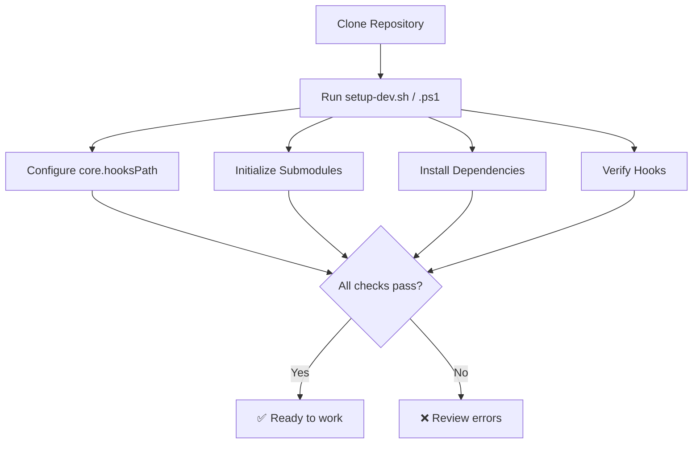
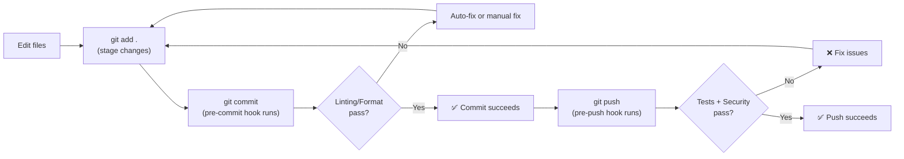

# Git Hooks & Quality Gates Rehydration Guide

This document describes how to fully rehydrate all git hooks, pre-commit checks, and CI/CD pipelines from the GitHub repository.

## Quick Start

After cloning the repository, run the appropriate setup script for your OS:

```bash
# Linux / macOS / Git Bash on Windows
bash scripts/setup-dev.sh

# Windows PowerShell
.\scripts\setup-dev.ps1
```

This single command will:

1. ✅ Configure git to use `.githooks/` for all hooks
2. ✅ Initialize git submodules (ai-project-guide documentation)
3. ✅ Install all Python development dependencies
4. ✅ Verify hook installation and display next steps

---

## What Gets Rehydrated

### 1. Local Git Hooks (.githooks/)

| Hook | Purpose | Stages | When Triggered |
|---|---|---|---|
| **pre-commit** | Runs pre-commit checks (lint, format, security) | commit | Before each commit |
| **commit-msg** | Validates commit message format | commit-msg | After commit message is written |
| **pre-push** | Runs tests + bandit + pip-audit before push | pre-push | Before pushing to remote |

**Location:** `.githooks/` directory

**How they're installed:**

```powershell
git config core.hooksPath .githooks
```

### 2. Pre-Commit Framework Configuration

**File:** `.pre-commit-config.yaml`

**Includes:** 28 quality gates across 7 categories

| Category | Tools | When |
|---|---|---|
| Markdown | markdownlint (auto-fix) | pre-commit |
| Python formatting | black | pre-commit |
| Python linting | ruff (auto-fix) | pre-commit |
| File hygiene | trailing whitespace, EOF fixer, merge conflict detection | pre-commit |
| CVE scanning | pip-audit | pre-push |
| Security | bandit static analysis | pre-push |
| Testing | pytest (TDD gate) | pre-push |

### 3. Python Dependencies

**File:** `pyproject.toml` → `[project.optional-dependencies]dev`

```toml
dev = [
    "pytest>=7.4",
    "pytest-asyncio>=0.23",  # ← async test fixtures
    "pytest-cov>=4.1",
    "pre-commit>=4.0",        # ← Pre-commit framework
    "ruff>=0.8",              # ← Python linting
    "black>=24.0",            # ← Python formatting
    "bandit>=1.8",            # ← Security scanning
    "hypothesis>=6.88",
    "pytest-xdist>=3.5",
    "pytest-timeout>=2.2",
    "aiosqlite>=0.18",
]
```

### 4. GitHub Actions CI/CD

**Files:** `.github/workflows/ci.yml`, `.github/workflows/security.yml`

**Runs on:**

- Every push to any branch
- Every pull request
- Scheduled security scans (4x daily)

**Pipeline:**

1. **Lint** (ubuntu-latest)
   - Pre-commit hooks (black, ruff, markdownlint, file checks)
   - Creates GitHub issues on failure

2. **Security** (ubuntu-latest)
   - Bandit static analysis (-ll = low+medium severity)
   - pip-audit dependency CVE scan

3. **Test** (ubuntu-latest)
   - pytest with coverage reporting
   - Creates GitHub issues on test failure

### 5. Git Submodules

**File:** `.gitmodules`

```properties
[submodule "project-documents/ai-project-guide"]
    path = project-documents/ai-project-guide
    url = https://github.com/ecorkran/ai-project-guide.git
```

**Initialized by:** `setup-dev.sh` / `setup-dev.ps1` with `git submodule update --init --recursive`

---

## Rehydration Flow

### Initial Setup (First Clone)



### Per-Commit Workflow



### Skip Hooks (Emergency Only)

```bash
# Skip all pre-commit checks
git commit --no-verify

# Skip all pre-push checks
git push --no-verify

# Skip specific hook with SKIP env var
SKIP=bandit,pytest-check git push
```

---

## Troubleshooting

### Problem: Hooks not running

**Solution 1: Reconfigure git hooks path**

```bash
git config core.hooksPath .githooks
```

**Solution 2: Reinstall from scratch**

```bash
# Windows
.\scripts\setup-dev.ps1

# Linux/macOS/Git Bash
bash scripts/setup-dev.sh
```

---

### Problem: Pre-commit not found

**Error:** `pre-commit: command not found`

**Solution:** Install development dependencies

```bash
pip install -e ".[dev]"
```

---

### Problem: Tests fail on push

**What happens:** pre-push hook runs `pytest` and blocks the push

**Options:**

1. **Fix the test** — Recommended, ensures code quality
2. **Skip hook** — Emergency only (not recommended)

   ```bash
   SKIP=pytest-check git push
   ```

3. **Check hook output** — Review the error messages carefully

---

### Problem: Bandit security scan fails

**What happens:** pre-push hook runs `bandit -r src -ll` and blocks the push

**Options:**

1. **Fix the security issue** — Recommended, addresses vulnerability
2. **Skip hook** — Emergency only (not recommended)

   ```bash
   SKIP=bandit git push
   ```

---

## Manual Quality Gate Checks

Run these commands anytime to check code quality without committing:

```bash
# All pre-commit checks (without committing)
pre-commit run --all-files

# Just linting
ruff check src/

# Just formatting
black --check src/

# Just security scan
bandit -r src -ll

# Just tests
pytest -q --tb=short

# Coverage report
pytest --cov=src --cov-report=html
```

---

## CI/CD Pipeline Details

### GitHub Actions: ci.yml

**Triggers:** `push` to any branch, `pull_request` to any branch

**Jobs:**

1. **lint** (~ 2 min)
   - Installs dev dependencies
   - Runs `pre-commit run --all-files`
   - Status: ✅ pass / ❌ fail

2. **security** (~ 3 min)
   - Runs bandit on src/ with -ll flag
   - Runs pip-audit on all dependencies
   - Status: ✅ pass / ❌ fail

3. **test** (~ 5 min)
   - Collects and runs pytest
   - If failure: Creates GitHub issue automatically
   - Generates coverage reports
   - Status: ✅ pass / ⏭️ continue-on-error

### GitHub Actions: security.yml

**Schedule:** 4x daily (06:00, 12:00, 18:00, 00:00 UTC)

**Jobs:**

- Dependency vulnerability audit (pip-audit)
- Bandit static analysis with JSON report
- Uploads artifact: `bandit-report.json`

---

## Files Summary

| File | Purpose | Commits | Status |
|---|---|---|---|
| `.githooks/pre-commit` | Pre-commit hook runner | All | ✅ |
| `.githooks/commit-msg` | Commit message validator | All | ✅ |
| `.githooks/pre-push` | Pre-push hook runner | All | ✅ |
| `.pre-commit-config.yaml` | Quality gate definitions | All | ✅ |
| `.github/workflows/ci.yml` | CI pipeline | All | ✅ |
| `.github/workflows/security.yml` | Security pipeline | All | ✅ |
| `pyproject.toml` | Dependencies | All | ✅ |
| `scripts/setup-dev.sh` | Unix/Linux/macOS setup | All | ✅ |
| `scripts/setup-dev.ps1` | Windows PowerShell setup | All | ✅ |
| `.gitmodules` | Submodule references | All | ✅ |

---

## Verification Checklist

After running setup, verify everything is working:

```bash
# ✅ Check 1: Hooks are configured
git config core.hooksPath              # Should output: .githooks

# ✅ Check 2: Dependencies are installed
pip list | grep -E "pre-commit|pytest-asyncio|bandit"

# ✅ Check 3: Pre-commit can run
pre-commit run --all-files             # Should pass all checks

# ✅ Check 4: Submodules are initialized
ls -la project-documents/ai-project-guide/

# ✅ Check 5: Tests can run
pytest --co -q                         # Should collect tests

# ✅ Check 6: Hook execution simulation
python -c "import pre_commit; print('✓ pre-commit ready')"
```

---

## Additional Resources

- **Pre-commit Framework:** <https://pre-commit.com/>
- **Ruff Documentation:** <https://docs.astral.sh/ruff/>
- **Black Documentation:** <https://black.readthedocs.io/>
- **Bandit Documentation:** <https://bandit.readthedocs.io/>
- **pytest Documentation:** <https://docs.pytest.org/>

---

**Last Updated:** March 9, 2026
**Version:** 1.0
