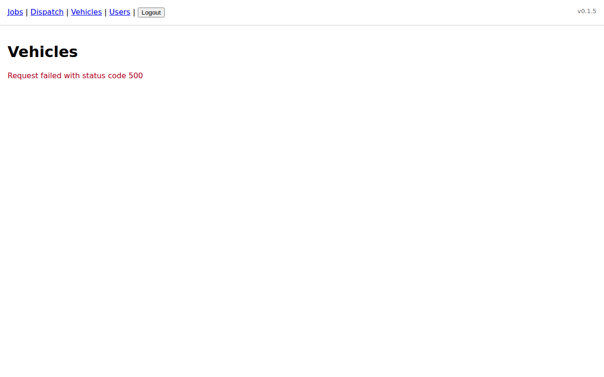
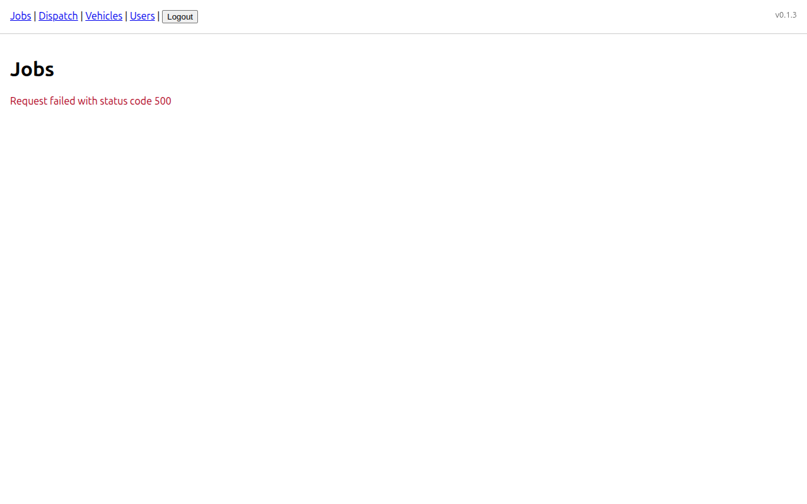
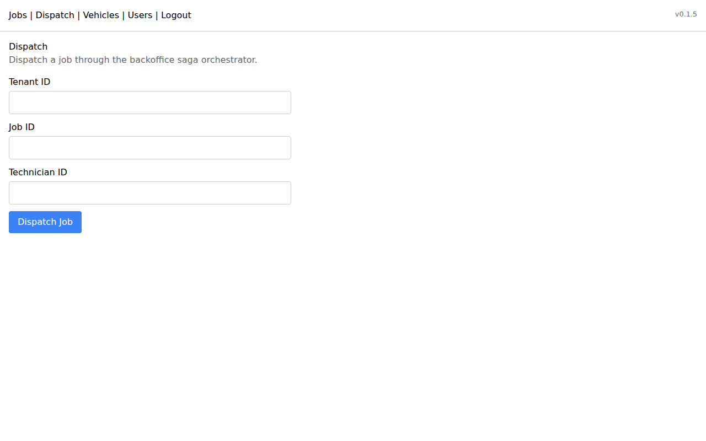

<!-- title: Getting Started -->

# Getting Started with Office Hero

This guide takes a new Company Admin from a fresh account to a first dispatched job. Follow the steps in order — each section builds on the previous one. Budget about 30 minutes for your first pass; you will be faster on subsequent days.

If you get stuck at any point, use the in-app chat bubble or call 1-800-HERO-FSM.

## First Login and Password Change

Your account is created by Office Hero support when your subscription activates. You receive a welcome email with a one-time login link.

1. Open the link in the welcome email. It takes you directly to the Office Hero sign-in page.
2. Click **Sign In with Link** — you do not need a password yet.
3. Once inside, click your name or avatar in the top-right corner of the screen.
4. Select **Account Settings** from the dropdown.
5. Under the **Security** section, click **Change Password**.
6. Enter a strong password in **New Password** and confirm it in **Confirm Password**. Passwords must be at least 10 characters.
7. Click **Save Password**. You are returned to the dashboard. Your next login will use your email and this password.

Keep your password private. Office Hero support will never ask for it.

## Invite Your First Team Member

You need at least one Dispatcher or Technician in the system before you can dispatch a job.

1. In the left sidebar, click **Settings**, then **Users**.
2. Click **Invite User** in the top-right corner.

   

3. Fill in the **First Name**, **Last Name**, and **Email Address** fields.
4. In the **Role** dropdown, choose the appropriate role:

   | Role | Choose this when... |
   |---|---|
   | Company Admin | You want this person to have full account access |
   | Dispatcher | They will create and assign jobs |
   | Sales | They manage customers and contracts |
   | Technician | They will be assigned to routes and jobs |
   | Technician Helper | They ride along; read-only on job details |

5. Click **Send Invite**. The person receives an email with a sign-in link valid for 48 hours.
6. Repeat for each team member you want to add now. You can always add more later.

The invited user does not need to accept before you continue — you can proceed with setup.

## Add Your First Vehicle

Vehicles are the unit of daily capacity in Office Hero. Each vehicle carries a crew and a route.

1. In the left sidebar, click **Vehicles**.
2. Click **Add Vehicle**.

   

3. Fill in the following fields:

   - **Vehicle Name** — a short label your team will recognize, such as "Truck 1" or "Van — Martinez".
   - **License Plate** — optional but useful for dispatch notes.
   - **Capacity** — the number of technicians this vehicle can carry (usually 1 or 2).
   - **Notes** — any equipment or specialization, e.g. "Carries pipe jetter".

4. Click **Save Vehicle**. The vehicle appears in the vehicle list.

## Assign a Technician to the Vehicle for Today

A crew assignment tells Office Hero which technician is driving which vehicle on a given day. Without it, the dispatch engine cannot route jobs.

1. From the **Vehicles** list, find the vehicle you just created and click **Assign Crew**.
2. In the **Date** field, today's date is pre-selected. Leave it as is.
3. In the **Lead Technician** dropdown, select the technician you invited earlier. If they have not accepted their invite yet, you can still assign them by name.
4. If this vehicle carries a helper, select them in the **Helper** dropdown (optional).
5. Click **Save Assignment**. The vehicle card now shows the crew member's name and is ready for dispatch.

You can update crew assignments any time before routes are started for the day.

## Add a Customer and Service Address

Every job is tied to a customer and a specific location where the work happens.

1. In the left sidebar, click **Customers**.
2. Click **Add Customer**.

   

3. Fill in the customer's details:

   - **Company Name** — if this is a business. Leave blank for residential customers.
   - **First Name** and **Last Name** — the primary contact person.
   - **Email** and **Phone** — used for job confirmations and technician notifications.

4. Click **Save Customer**. You are taken to the customer's detail page.
5. Under the **Locations** section, click **Add Location**.
6. Enter the service address:

   - **Address Line 1** — street number and name.
   - **Address Line 2** — unit, suite, or apartment (optional).
   - **City**, **State**, **ZIP**.
   - **Location Notes** — access codes, parking instructions, gate codes. Your technicians will see these in the app.

7. Click **Save Location**. Office Hero geocodes the address automatically. If the pin lands in the wrong place, drag it on the mini-map to correct it.

A customer can have any number of locations. The same customer that owns a home and a rental property can have both addresses on file — just add a second location.

## Create Your First Job

A job is a single service visit at a specific location.

1. In the left sidebar, click **Jobs**.
2. Click **New Job**.

   

3. Complete the job form:

   - **Customer** — start typing the customer's name and select from the dropdown.
   - **Location** — choose from the customer's saved addresses.
   - **Job Type** — select the category of work (e.g., "Maintenance", "Repair", "Installation").
   - **Scheduled Date** — the day you want this job to happen.
   - **Estimated Duration** — how long you expect the job to take, in hours and minutes. This helps the dispatch engine plan the route.
   - **Priority** — Normal, High, or Urgent. High and Urgent jobs are ranked first when the dispatch engine builds options.
   - **Description** — a brief note about the work. Technicians see this in the mobile app.

4. Click **Save Job**. The job is created in **Pending** status and appears in the job list with a blue Pending badge.

## Dispatch the Job

Dispatching assigns the job to a vehicle and crew and adds it to their route for the day.

1. From the **Jobs** list, click the job you just created.
2. Click **Dispatch Job** in the top-right of the job detail page.

   

3. Office Hero evaluates available vehicles and presents up to three route options in under 8 seconds:

   | Option | How it works |
   |---|---|
   | **Nearest** | Assigns the technician whose current location is closest to the job site |
   | **Earliest** | Assigns the technician who can reach the job site soonest, accounting for their existing stops |
   | **Balanced** | Distributes work evenly across all active vehicles |

4. Review the options. Each card shows the assigned technician, estimated arrival time, and total route length for the day.
5. Click **Select** on the option that fits your needs. If none of the options suit you, click **Custom** to manually choose a vehicle and set the stop sequence yourself.
6. Click **Confirm Dispatch**. The job status changes from **Pending** to **Dispatched**, and the technician's mobile app updates immediately.

The technician will see the new stop at the top of their route list. Their GPS position is refreshed every 30 seconds, so you can track progress from the **Routes** view.

## What Happens Next

Once a job is dispatched:

- The technician opens the Office Hero mobile app (or mobile web at `go.officehero.dev`) and sees the stop in their daily route.
- They tap **Arrived** when they reach the location and **Complete** when the work is done.
- The job status in your dashboard updates in real time — no phone calls needed.
- You can view the full timeline of status changes in the job's **Activity Log**.

When you are ready to set up recurring work — like a quarterly maintenance contract that generates jobs automatically — see the [Contracts Guide](contracts-guide.md).

For a deeper look at dispatch options and monitoring active routes, see the [Dispatch Guide](dispatch-guide.md).
